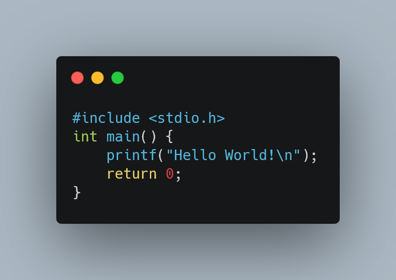

# 💻 Programming 1 Assignments Portfolio
An archive of my coursework from Programming 1, written in C.

  
   
  ⚖️ <em>Image Credits:</em> <a href="https://carbon.now.sh">Carbon.now.sh</a>

# 🌐 Repository Overview and Quick Links
| Assignment | Description | Quick Link |
| :---: | :---: | :---: |
| Spiral Matrix | Makes use of an array to print out numbers in a spiral. |[Source](https://github.com/NullPointerHQ/C-Programming-1-Fundamentals/blob/main/src/spiral-array.c)|
| Student Grading System | Uses C structs and Dynamic Memory Allocation to create a class grading system database. |[Source](https://github.com/NullPointerHQ/C-Programming-1-Fundamentals/blob/main/src/student-grading-system.c)|
| Password Generator | Generates a random password based on user-defined settings. |[Source](https://github.com/NullPointerHQ/C-Programming-1-Fundamentals/blob/main/src/password-generator.c)|
| Rail Fence Cipher | 'Encrypts' messages using 'Rail-Fence' Encryption. |[Source](https://github.com/NullPointerHQ/C-Programming-1-Fundamentals/blob/main/src/rail-fence-cipher.c)|
| Tic-Tac-Toe | Standard Tic-Tac-Toe Game |[Source](https://github.com/NullPointerHQ/C-Programming-1-Fundamentals/blob/main/src/tictactoe.c)|

# 🛠️ Software Requirements
* Environment: Any C-compatible compiler/editor. I recommend Microsoft's [Visual Studio Code](https://code.visualstudio.com/) configured with GCC.
# ⚠️ Disclaimer
_All code is provided as-is for archival and demonstration purposes. No ongoing maintenance or support is provided._
